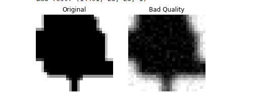

# Arabic Handwritten Digit Recognition Using CNN - CS417 Final Project

This project implements a Convolutional Neural Network (CNN) for classifying handwritten Arabic digits. The goal is to accurately recognize digits from 0 to 9 in image format, addressing the unique challenges presented by variations in Arabic script. This model is trained to provide a robust solution for automated recognition tasks.

## 📌 Project Overview

Handwritten digit recognition is a fundamental computer vision problem. In this project, a CNN model is trained to classify Arabic handwritten digits. CNNs are well-suited for this task because they automatically learn spatial features such as edges, curves, and shapes from images.

---

## 🧠 Features

* **Data Preprocessing:** 
  Image resizing, normalization, dataset splitting, and image degradation for robust learning.

* **CNN Architecture:** 
  A deep learning model built using TensorFlow / Keras.

* **Model Training:**
  Training pipeline with validation to monitor performance.

* **Evaluation:**
  Model evaluation using accuracy and loss metrics.

* **Inference:** 
  Predict Arabic handwritten digits from unseen images.

---

## 🖼️ Image Degradation Example

Example of an original handwritten digit image and its degraded version after applying noise during preprocessing.




---

## 📁 Repository Structure

```
arabic-handwritten-digit-recognition-cnn/
│
├── Data/                     # Dataset and processed data
├── code/                     # Source code
│   ├── model.py              # CNN architecture
│   ├── train.py              # Training script
│   ├── evaluate.py           # Model evaluation
│   └── predict.py            # Inference script
└── README.md
```

---

## 🧰 Dataset

This project uses an **Arabic Handwritten Digits dataset** containing images of digits from 0 to 9 written by multiple individuals.

> ℹ️ If you are using a specific dataset (e.g., AHCD, MADBase, or a custom dataset), update this section with the dataset name and source.

---

## 🚀 Installation & Setup

Clone the repository and install dependencies:

```bash
git clone https://github.com/abanoub-refaat/arabic-handwritten-digit-recognition-cnn.git
cd arabic-handwritten-digit-recognition-cnn
```

Make sure you are using **Python 3.x** and have **TensorFlow** installed.

---

## 🏋️ Training the Model

To train the CNN model:

```bash
python code/train.py
```

This will:

1. Load and preprocess the dataset
2. Build the CNN model
3. Train the model
4. Save the trained weights

---

## 📊 Evaluating the Model

After training, evaluate the model performance:

```bash
python code/evaluate.py
```

The evaluation outputs accuracy and loss on the test dataset.

---

## 📈 Model Performance & Results

### Learning Curve

The following plot shows the training and validation accuracy/loss over epochs, helping analyze convergence and potential overfitting.


### Confusion Matrix

The confusion matrix illustrates how well the model classifies each Arabic digit (0–9) and highlights common misclassifications.


---

## 🔍 Making Predictions

Use the trained model to predict a handwritten digit:

```bash
python code/predict.py --image path/to/image.png
```

Example:

```python
from tensorflow.keras.models import load_model

model = load_model("outputs/model.h5")
prediction = model.predict(image)
print(prediction.argmax())
```

---

## 📚 Technologies Used

* Python
* TensorFlow / Keras
* NumPy
* OpenCV / PIL (for image processing)
* Matplotlib

---

## ⭐ Contributions

Contributions are welcome!

1. Fork the repository
2. Create a new branch (`git checkout -b feature-name`)
3. Commit your changes
4. Push to your fork and open a Pull Request
